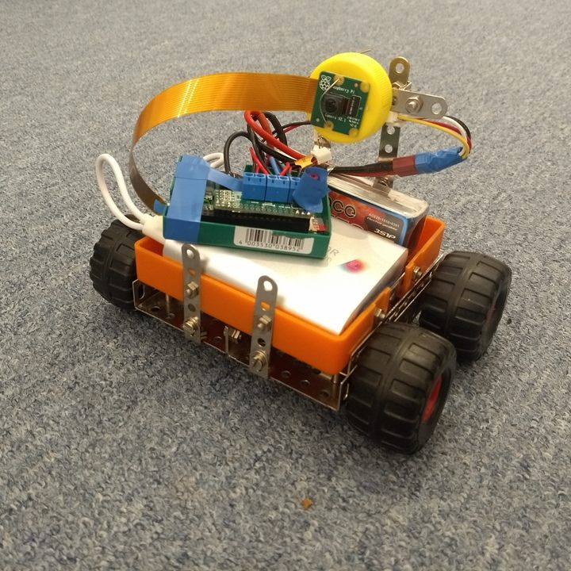
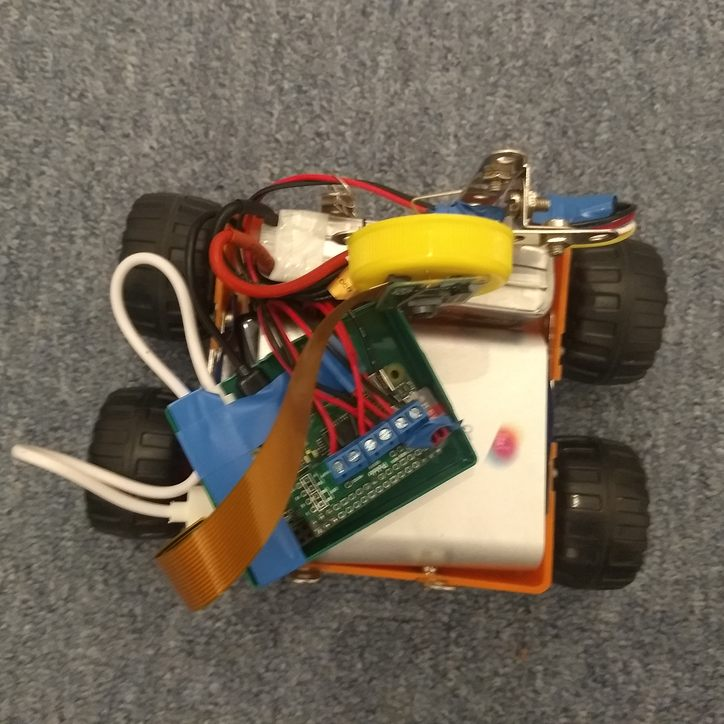
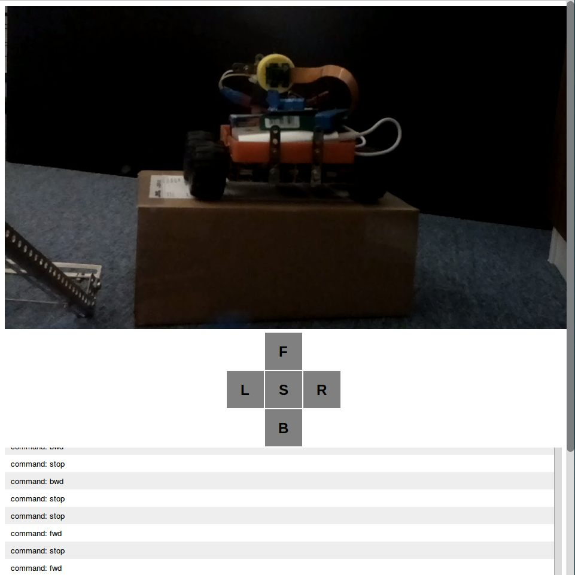

# Raspberry Pi Robot remote control
Remote controlled robot with camera. Based on Raspberry Pi Zero. 

Selfie by the rover

## Hardware 
* Raspberry Pi Zero
* Camera
* Controller for DC motors [Pololu DRV8835](https://www.pololu.com/product/2753) or something similar

### GPIO connections:
* 5 - direction left
* 12 - speed left
* 6 - direction right
* 13 - speed right

## Installation
On raspberry install 
* pigpiod (has to be running as root)
* node js

Enable access to camera

* `npm install`
* `node index.js`

Now you can access the controls via your browser:
`http://YOUR-RASPBERRY:3000/`

## Inspired by
* [Socket.IO guide](http://socket.io/get-started/chat/) 
* [Telepresence rover](https://github.com/shimniok/bot-thoughts-blog/tree/master/RPiTeleRover)
* [express-ws-chat-sample](https://github.com/y-temp4/express-ws-chat-sample)
* [pi-cam](https://github.com/pimterry/pi-cam)
